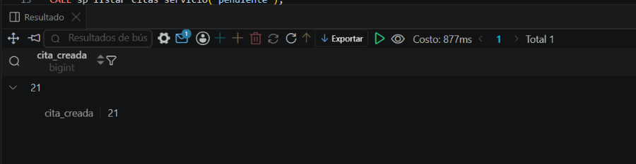
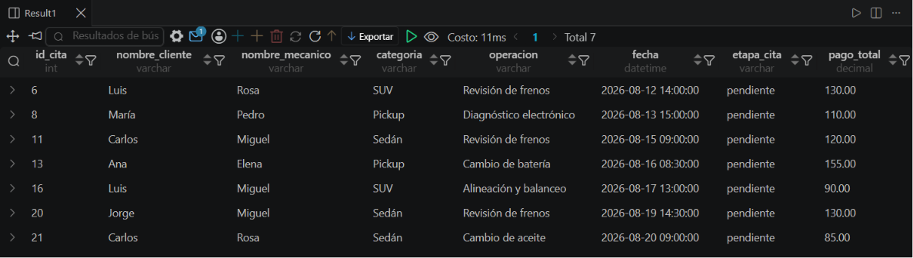
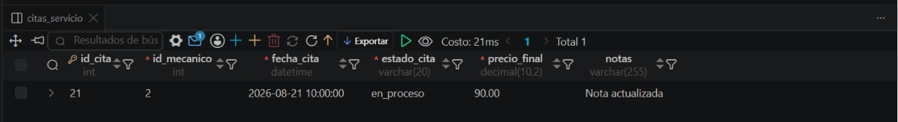
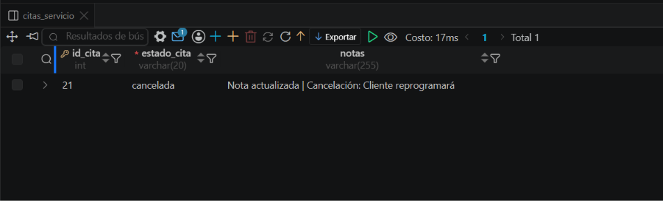
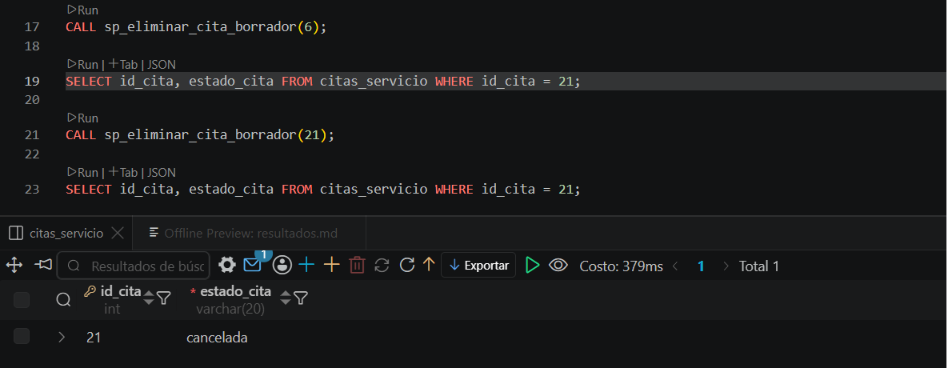

# Evidencias de Ejecución — Garage Elite Campus

## 1. Crear cita (caso exitoso)
```sql
CALL sp_crear_cita_servicio(1, 2, 1, '2026-08-20 09:00:00', 85.00, 'Prueba de creación', @nueva_cita);
SELECT @nueva_cita AS cita_creada;
```
Resultado: cita creada con id = 21, estado inicial 'pendiente'.



## 2. Listar citas pendientes
```sql
CALL sp_listar_citas_servicio('pendiente');
```
Resultado: 7 filas devueltas, todas con estado_cita = 'pendiente'.



## 3. Actualizar cita
```sql
CALL sp_actualizar_cita_servicio(21, 2, '2026-08-21 10:00:00', 'en_proceso', 90.00, 'Nota actualizada');
```

Resultado: cita 21 actualizada — mecanico=2, fecha=2026-08-21 10:00:00, estado=en_proceso, precio=90.00, notas='Nota actualizada'. 



## 4. Cancelar cita
```sql
CALL sp_cancelar_cita_servicio(@nueva_cita, 'Cliente reprogramará');
```
Resultado: cita 21 cambió a estado='cancelada', notas='Nota actualizada | Cancelación: Cliente reprogramará'. No se eliminó la fila (borrado lógico).
 


## 5. Eliminar borrador
```sql
CALL sp_eliminar_cita_borrador(6);
SELECT id_cita, estado_cita FROM citas_servicio WHERE id_cita = 6;  -- después: 0 filas
```

Resultado: cita 6 eliminada físicamente. Confirmado por ausencia de filas en el SELECT posterior.

 

## 6. Prueba de error a propósito
```sql
CALL sp_crear_cita_servicio(1, 2, 1, '2026-08-20 09:00:00', -50.00, 'Prueba de error', @cita_error);
```
Resultado esperado: `ERROR 1644 (45000): El precio final no puede ser negativo`.

 